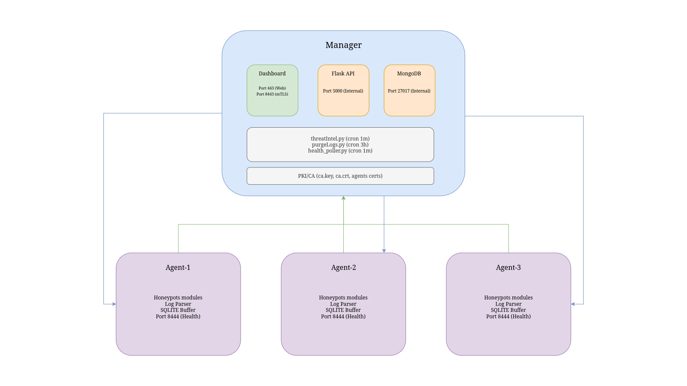
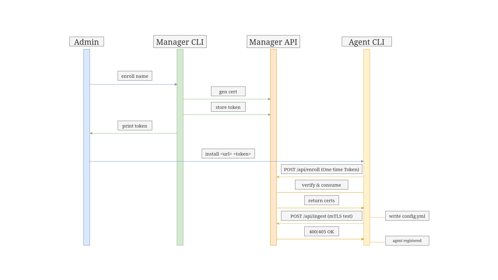
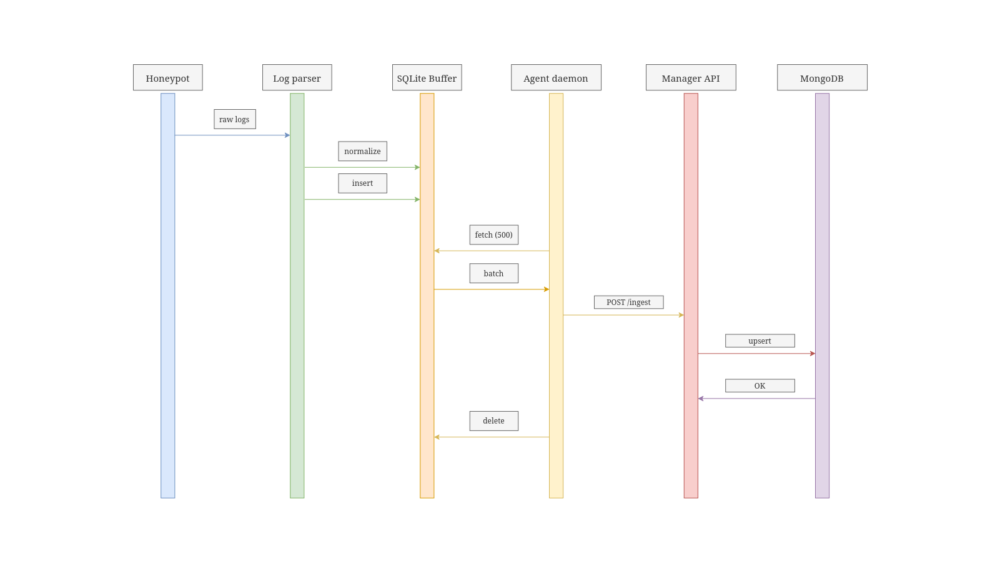

Architecture
============

.. warning::

   Please use this tool with care, and remember to deploy agents on dedicated servers that are properly isolated from your production infrastructure.

Manager / Agent Model
---------------------

Melissae uses a distributed **manager/agent** architecture:

- **Manager**: Centralizes MongoDB, the Flask API, the dashboard, threat scoring, and agent monitoring. Does not run honeypots.
- **Agents**: Deploy honeypot modules, parse raw logs locally into normalized JSON, and push data to the manager. Expose a health endpoint for the manager to poll.

Communication
-------------

.. list-table::
   :header-rows: 1
   :widths: 20 20 10 50

   * - Direction
     - Channel
     - Port
     - Purpose
   * - Agent → Manager
     - HTTPS + mTLS
     - 8443
     - Log ingestion (``POST /api/ingest``)
   * - Agent → Manager
     - HTTPS (token)
     - 8443
     - Enrollment (``POST /api/enroll``)
   * - Manager → Agent
     - HTTPS + mTLS
     - 8444
     - Health polling (``GET /health``)
   * - Manager → Agent
     - HTTPS + mTLS
     - 8444
     - Remote management (``POST /command``)

**Push model**: Agents parse logs locally, buffer them in SQLite, and push batches (up to 500 entries) to the manager every 10 seconds (configurable). If the manager is unreachable, logs accumulate in the local buffer with exponential backoff retry.

**Pull model**: The manager polls each agent's health endpoint every minute, collecting container statuses, buffer state, and uptime.

PKI & mTLS
-----------

Melissae includes an embedded PKI (no external tools required):

- **CA**: ECDSA P-384, 10-year validity, auto-generated on ``install``
- **Agent certificates**: Dual-purpose (client + server), 1-year validity, generated during enrollment
- **Manager certificate**: Dual-purpose (client + server), 1-year validity, generated on ``install``
- **Enrollment**: One-time tokens (64 hex chars, 10-minute TTL). The manager generates the token + cert, the agent fetches them via ``POST /api/enroll``
- **Revocation**: CRL-based, the manager can revoke agent certs and regenerate the CRL

Nginx terminates mTLS on ``:8443``, validates the client certificate against the CA, and injects ``X-SSL-Client-CN`` for the API to verify agent identity.

Workflow
--------

1. Honeypots on agents write raw logs to shared volumes.
2. ``log_parser.py`` performs **incremental parsing**: reads new log lines, normalizes to JSON, deduplicates with deterministic hashes.
3. ``agent_daemon.py`` buffers parsed logs in SQLite, pushes batches to ``POST /api/ingest`` with mTLS.
4. The manager API validates the mTLS identity, sanitizes inputs, and upserts into MongoDB (``logs``).
5. ``threatIntel.py`` recalculates verdicts into MongoDB (``threats``), tracking which agents observed each IP.
6. The dashboard consumes ``/api/logs``, ``/api/threats``, and ``/api/agents``.
7. ``health_poller.py`` polls agents via mTLS and updates their status in MongoDB.
8. The manager CLI can send remote management commands (``POST /command``) to agents via mTLS (start, stop, restart, status).

Enrollment Sequence
-------------------

Log Push Sequence
-----------------

.. note::

   **Firewall requirements:**

   - Manager: open **TCP 443** (dashboard HTTPS) and **TCP 8443** (mTLS ingestion + enrollment) to the agents and your browser.
   - Agents: open **TCP 8444** (health endpoint) to the manager only. Honeypot ports (22, 21, 23, 1883, 502, 80/443) should be open to the internet.
   - MongoDB (:27017) and the Flask API (:5000) are bound to ``127.0.0.1`` and never exposed externally.

Scheduled Jobs
--------------

On the **manager** (added during ``install``):

.. list-table::
   :header-rows: 1
   :widths: 20 30 50

   * - Schedule
     - Script
     - Purpose
   * - Every minute
     - ``threatIntel.py``
     - Recalculates threat verdicts
   * - Every minute
     - ``health_poller.py``
     - Polls agent health endpoints
   * - Every 3 hours
     - ``purgeLogs.py``
     - Removes stale benign IoCs and logs
