Dashboard
=========

Overview Dashboard
------------------

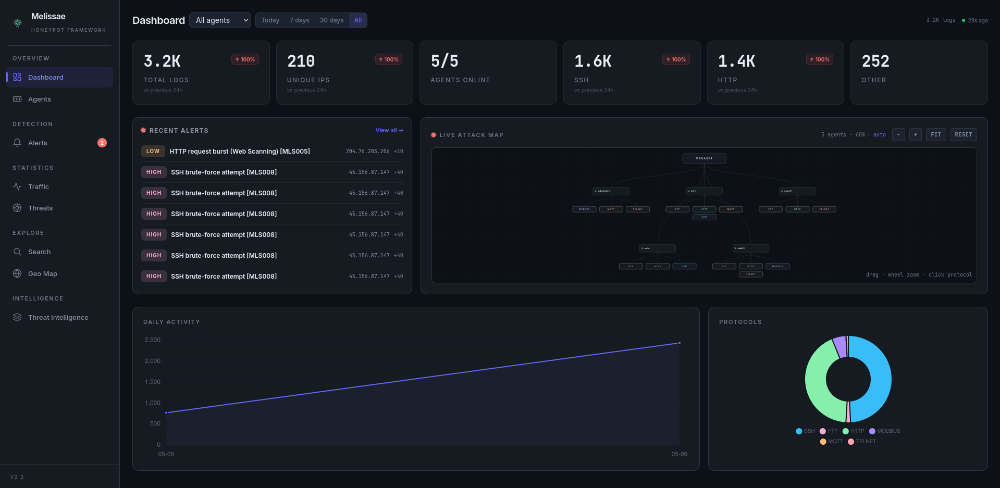

|

The main view provides a comprehensive real-time overview:

- **Stat Cards** with trend arrows — Total events, unique IPs, malicious verdicts, per-protocol breakdowns. Each card shows a percentage change vs the previous 24h (↑/↓ indicators).
- **Date Range Filter** — Toggle between Today, 7 days, 30 days, or All to scope the dashboard.
- **Auto-Refresh** — Dashboard data refreshes every 30 seconds with a live "Xs ago" indicator.
- **Multi-Day Timeline** — Line chart showing daily event volume over the selected range.
- **Activity Heatmap** — Day-of-week × hour-of-day grid with color intensity, revealing peak attack windows.
- **Activity Bar Chart** — Hourly event distribution.
- **Protocol Doughnut** — Visual breakdown of traffic by protocol.
- **Agent Bar Chart** — Event volume per agent.
- **Top Attackers List** — Top attacking IPs with country flags (via GeoIP enrichment).
- **Top Credentials** — Top 10 attempted usernames across SSH/FTP/Telnet with hit counts.

**Critical Events Section**: When security-critical events are detected (CVE exploits, successful logins on Telnet/SSH/FTP, Modbus write attempts), a highlighted alert section appears at the top of the dashboard with red-themed cards showing event counts.

Agents Page
-----------

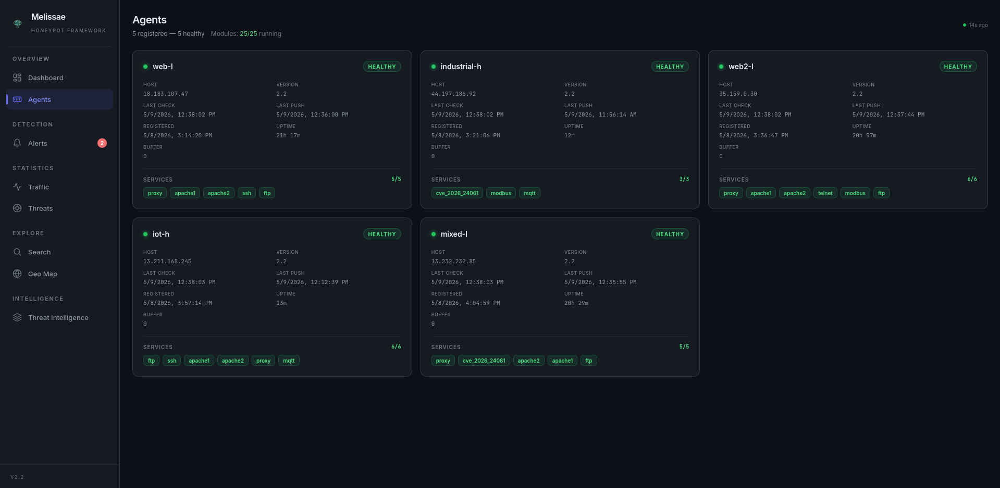

|

The ``/agents`` page provides real-time visibility into the agent fleet (auto-refreshes every 15s):

- Status indicator (healthy / degraded / unreachable / pending) with color coding
- Host address, last push time, last health check
- Active modules per agent with running/stopped state, aggregate running/total count
- Buffer pending count and uptime
- Live refresh indicator with "Xs ago" counter

GeoIP Attack Map
----------------

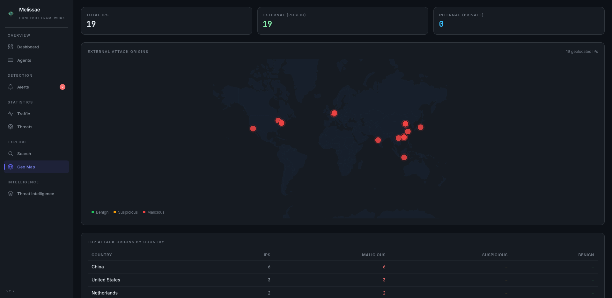

|

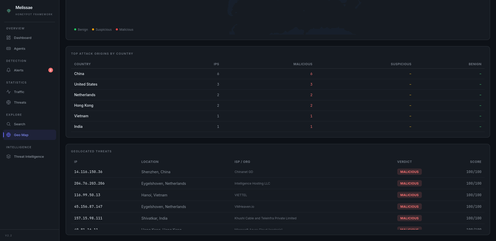

|

The ``/map`` page automatically adapts its display based on the types of IPs detected:

.. list-table::
   :header-rows: 1
   :widths: 30 70

   * - IP mix
     - Display
   * - All private IPs
     - Summary stats + Internal Network Threats table
   * - All public IPs
     - Summary stats + Interactive world map + Country breakdown + Geolocated threats table

The detection is automatic — public IPs are geolocated and shown on the map, private IPs are listed in a separate table. No configuration needed.

**GeoIP Enrichment**: Public IPs are geolocated via `ip-api.com <https://ip-api.com/>`_ batch API (free tier, no API key). Results are cached in MongoDB, coordinates validated, and all fields sanitized before storage.

Search Engine
-------------

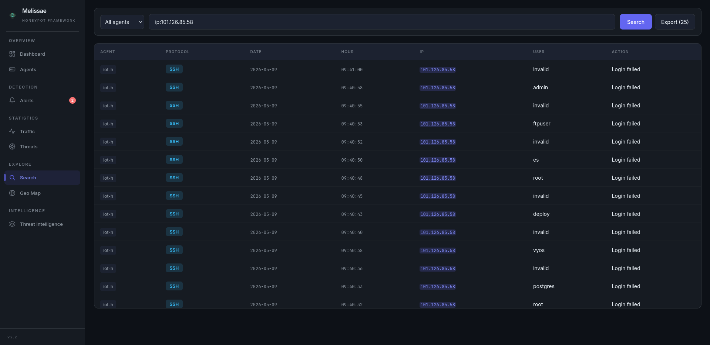

|

**Features:**

- **Backed by the API** — Logs are loaded from ``/api/logs`` (MongoDB).
- **Search with logical operators** — Use operators to combine multiple criteria in your search.
- **Field-specific filters** — Search within specific fields like ``user``, ``ip``, ``protocol``, ``date``, ``hour``, ``action``, ``user-agent``, ``path``, or ``cve`` using the syntax ``field:value``.
- **Sortable Columns** — Click any column header to sort ascending/descending.
- **Pagination** — Configurable page sizes (25/50/100/250) with navigation controls.
- **Agent Filter** — Dropdown to scope search results to a specific agent.
- **Export results** — A button allows exporting the filtered logs.

**Operators:**

- ``AND`` / ``and``
- ``OR`` / ``or``
- ``NOT`` / ``not`` / ``!``

**Examples:**

.. code-block:: text

   user:root and protocol:ssh
   ip:192.168.X.X or ip:192.168.X.Y or ip:192.168.X.Z
   protocol:http and not action:success
   protocol:modbus and action:write
   user:admin or not path:/login
   !ip:192.168.X.X and action:failed
   protocol:modbus and action:read
   cve:CVE-2026-24061
   protocol:telnet and action:successful

Threat Intelligence
-------------------

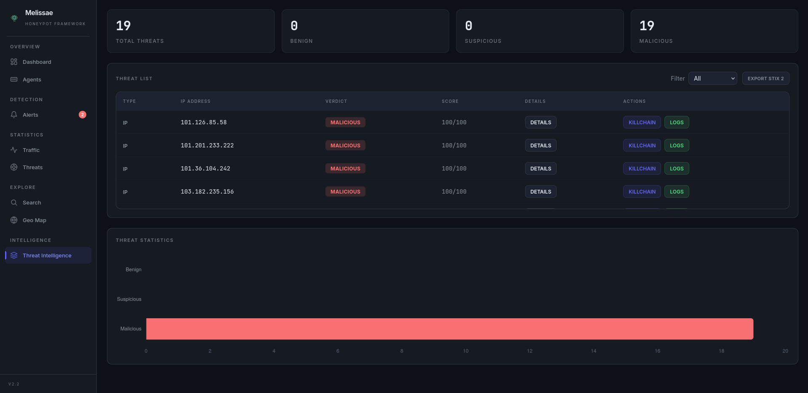

|

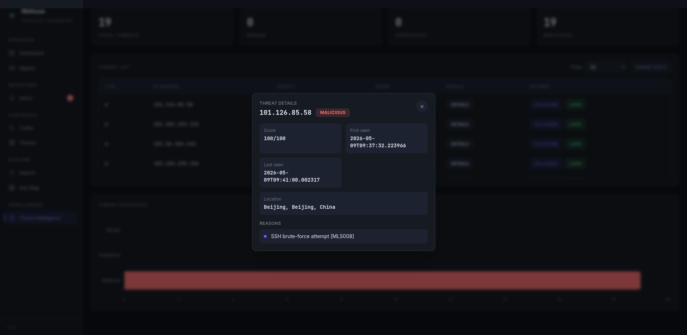

|

The Threat Intelligence page lists all scored IPs with verdict tags and accumulated rule scores. Each row offers:

- **Details panel** — Modal showing IP, verdict, score/100, timestamps, and the list of rules that matched.
- **Killchain timeline** — Events grouped by protocol with start/end timestamps, ordered from oldest to newest.
- **STIX 2.1 Export** — Download a STIX 2.1 bundle (one indicator per IP) for selected or all threats.

Alerts
------

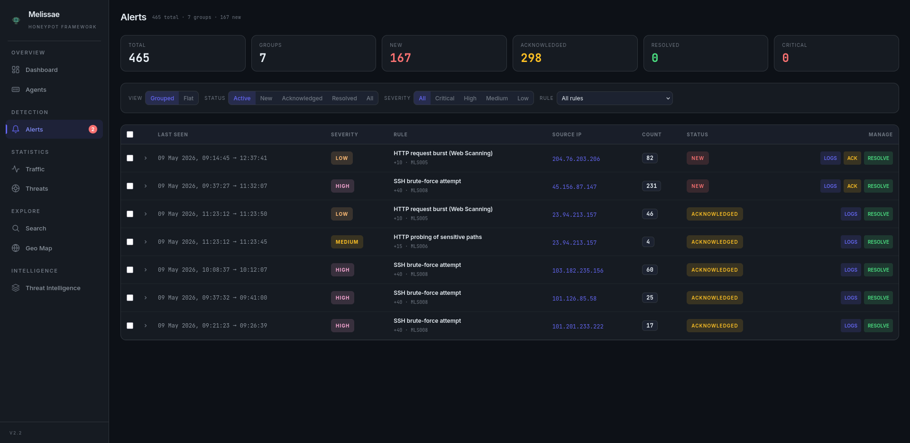

|

The ``/alerts`` page is the primary surface for the **rule-based alerting engine** introduced in v2.2.

- **Two view modes** — *Grouped* (one row per ``rule_id`` + IP, with last seen and hit count) or *Flat* (one row per individual alert).
- **Filters** — Status (``new`` / ``acknowledged`` / ``resolved`` / *All*) and severity (``critical`` / ``high`` / ``medium`` / ``low``).
- **Bulk actions** — Select multiple alerts and acknowledge or resolve them in a single request.
- **Auto-refresh** — New alerts appear every 20 seconds.
- **Drill-down** — Each alert links to the matching IP killchain and to the underlying logs.

Agent Topology
--------------

A dedicated interactive canvas rendering the live deployment as a graph **manager ↔ agents ↔ modules**:

- Drag-and-drop positioning of any node, with positions persisted in ``localStorage``.
- Zoom / pan / fit-to-view controls.
- Per-protocol coloring of module nodes (SSH, HTTP, FTP, Modbus, MQTT, Telnet).
- Live health overlay reusing the same data feed as the *Agents* page.

Activity & Attacker Statistics
------------------------------

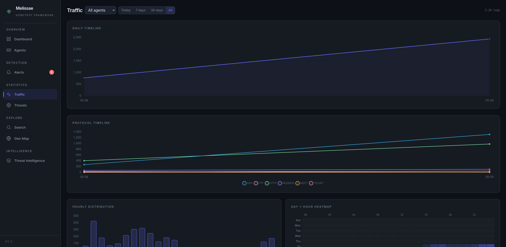

|

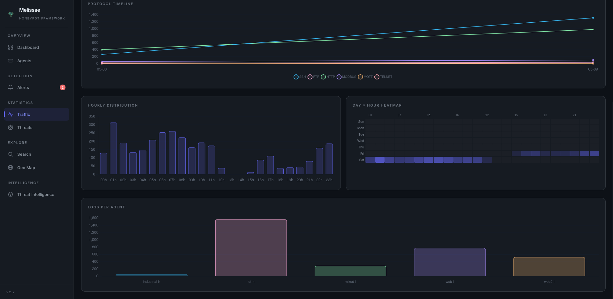

|

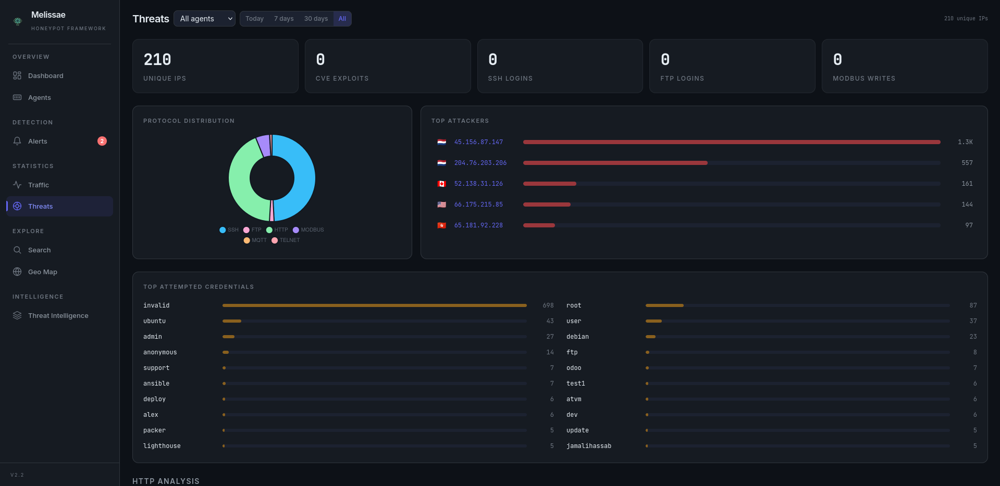

|

Two dedicated statistics pages complement the main dashboard:

- ``/stats/activity`` — traffic patterns over time (volumes, protocol mix, hourly distribution, day×hour heatmap).
- ``/stats/attackers`` — per-attacker breakdowns (top IPs, top credentials, top user-agents, geo distribution).

Rules
-----

The API exposes the catalog of YAML rules at ``GET /api/rules`` together with last-run metadata (``last_run_at``, ``last_alerts_emitted``, ``last_groups_triggered``). The dashboard surfaces this catalog so reviewers can see at a glance which rules are enabled, their severity, MQL query, threshold and contribution to the score.
